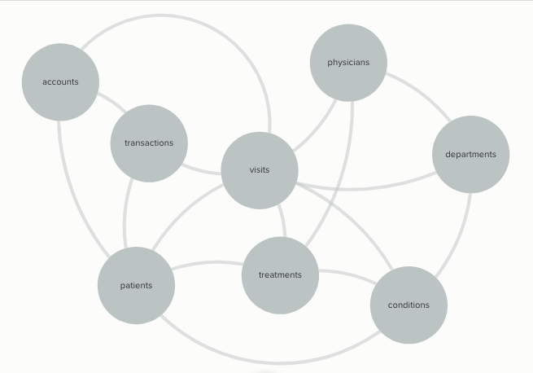

```{r setup, include=FALSE}
knitr::opts_chunk$set(echo = TRUE)
```


## 1. List 10 questions you want to be able to answer using the Hospitals Data Warehouse (10%).  

* Which departments/procedures generate the most revenue (overall),  the most revenue per patient, and most revenue per quarter(or month)?
    + Which procedures can be scaled up to generate more revenue?  

* What are the biggest expenses and can they be minimized?  
* Which treatments are the most popular?  
* What services/treatments/patients require involvement from multiple departments?  
* Which treatments are most correlated (if a patient uses one, they're likely to use the other)? 
* What are the drivers of length of hospital stay?  E.g. doctor, patient, health record attributes, department, procedure, etc.?  

* Which doctors within the same department have a higher repeat treatment rate?
* Which patients have the most complications (repeat visits), and which doctors/departments see patients with the highest rates of complications?  
* Which complications are covered by insurance (i.e. someone else pays) versus ones the hospital is responsible for (i.e. the hospital loses money)?  
* What are the sources of revenue (e.g. insurance, government, private pay, other)?  
* What is the average fill rate for the hospital beds?  
  
  
  
## 2 Entities we should include:

* Patients
* Physicians
* Departments
* Visits
* Conditions
* Accounts
* Transactions
* Treatments


## 3 Relationships between entities:

* Patients should link to:
    + Visits
    + Accounts
    + Transactions
    + Conditions
    + Treatments
* Physicians should link to:
    + Visits
    + Treatments
    + Departments
* Departments should link to:
    + Physicians
    + Visits
    + Conditions
* Visits should link to:
    + Patients
    + Physicians
    + Conditions
    + Treatments
    + Departments
* Conditions should link to 
    + Patients
    + Visits
    + Departments
    + Treatments
* Accounts should link to
    + Patients
    + Transactions
* Transactions should link to
    + Accounts
    + Patients
    + Visits
* Treatments should link to
    + Patients
    + Visits
    + Physicians
    + Conditions
    + Transactions


## 4 Draw a diagram of the entities above and their relationships
*Please refer to Figure 1: dataWarehouseMap



## 5 Attributes for each entity

* Patients should include
    + unique identifier/account number
    + name
    + date of birth
    + date of first visit
    + date of last visit (wouldn't this have to autoupdate from Visits?)
* Physicians should include
    + unique identifier
    + physician name 
    + department
    + specialty
* Visits should include
    + dates/times
    + patient ID
    + physician ID
    + diagnostic code / condition
    + treatment
    + notes/follow up
 * Accounts should include
    + patient name
    + patient date of birth
    + patient address + zip
    + unique identifier/account number
    + insurance carrier + info
    + Primary Care Physician info
 * Transactions should include
    + account number 
    + patient name
    + patient address + zip
    + insurance carrier + info
    + physician name
    + visit date
    + diagnostic code / condition

## 6 Primitive vs Derived attributes

The following attributes must be primitive (raw data):

+ All date and time information (including birthdates)
+ patient/physician/facility/insurance carrier names
+ addresses and contact information
+ unique identifiers/account numbers
+ diagnosis condition

The following attributes would be derived from raw data figures:
+ Yearly/Quaterly/Monthly cost of each patient (derived from patients and transactions)
+ Yearly/Quaterly/Monthly visits of each patient (derived from patients and visits)
+ Yearly/Quaterly/Monthly visits for each doctor (derived from physicians and visits)
+ Any growth, trend, ratio, or percentage comparison must be derived from other measures


