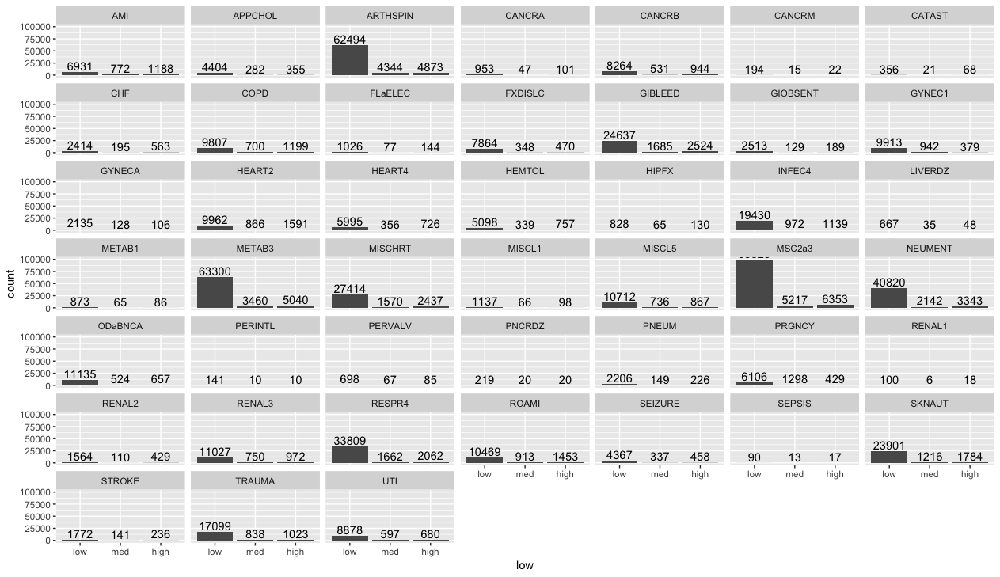

```{r setup, include=FALSE}
knitr::opts_chunk$set(echo = TRUE)

packages <- c("knitr", "tidyverse")

lapply(packages, require, character.only = T)

options(digits = 2, scipen = 999)
```


## Data Mining by Hand Exercise

```{r load data}
heritage <- readRDS("Heritage.rds") 
# full Heritage.xlsx main data with "risk_group" assigned as outlined in the Homework #2 intro.
names(heritage)
```

Recreate pivot table from given data Excel workbook
```{r pivot table}
H_pivot <- heritage %>%
   group_by(CharlsonIndex, PrimaryConditionGroup) %>%
   summarize(aveY2 = mean(DaysInHospital_Y2)) %>%
   spread(CharlsonIndex, aveY2) #%>%
   #select(1,5,3,4,2)
```

To find the 1R rule, we need know the cardinality of each grouping variable and the *purity* of each `risk_group` filtered by a single variable as shown in the text section 4.1. I'll reuse code from homework 1 to make a table showing the attributes of each of the variables. 

```{r custom functions from HW1}
countNA <- function(x) {sum(is.na(x)) } # count the number of missing data entries
get_range <- function(x) {ifelse(is.numeric(x), diff(range(x)), NA)}

make_partBtable <- function(x){
   df <- tibble(variable_name = names(x),
                variable_type = NA,
                variable_class = map_chr(x, class),
                count_missing = map_int(x, countNA),
                count_unique = map_dbl(x, ~length(unique(.x)) ),
                variable_range = map_dbl(x, get_range))
   return(df)

}
```


```{r H_var table}
H_vars <- make_partBtable(heritage)

kable(H_vars, caption = "Heritage data set variable attributes")
```

The first five variables are patient, doctor, and facility type identifiers that will not be useful at this time. The `Year` variable also contains no missing values and only a single unique entry, so it will also not be useful at this time. Additionally, the `paydelay` and `LengthOfStay` variables have so many missing observations, that its questionable if they are useful at this time. The `risk_group` variable is a binning of the `DaysInHospital_Y2` numeric value according to the Homework description. 

+ the "low" `risk_group` is `DaysInHospital_Y2` < 3
+ the "med" `risk_group` is `DaysInHospital_Y2` < 6 & `DaysInHospital_Y2` >= 3
+ the "high" `risk_group` is `DaysInHospital_Y2` >= 6

I'll continue working at this time with a selected subset of the remaining variables. 

```{r subset heritage}
h_subset <- select(heritage, c("specialty", "placesvc", "dsfs", "PrimaryConditionGroup", 
                               "CharlsonIndex", "sex", "LengthOfStay", "AgeAtFirstClaim", 
                               "DaysInHospital_Y2", "risk_group"))
h_subset$risk_group <- ordered(h_subset$risk_group, levels = c("low","med","high"))
str(h_subset)
```

Now for a couple of custom functions to speed up the single variable exploration.

**graphical inspection**
```{r ggplot risk_group function}
risk_group_counts <- ggplot(h_subset, aes(x = risk_group)) +
   geom_text(aes(label = ..count..), stat = "count", vjust = -0.25) +
   geom_bar() +
   scale_x_discrete(c("low", "med", "high"))
```


```{r ggplot boxplot Y2 with mean and count info, eval=F, include=F}
# https://medium.com/@gscheithauer/how-to-add-number-of-observations-to-a-ggplot2-boxplot-b22710f7ef80
#stat_box_data <- function(y, upper_limit = max(h_subset$DaysInHospital_Y2) * 1.15) {
#   sbd <- tibble(y = 0.95 * upper_limit,
#                 label = paste('count =', length(y), '\n',
#                               'mean =', round(mean(y), 1), '/n'))
#   return(sbd)
#}

daysY2boxplots <- function(df = h_subset, x, 
                           y = h_subset$DaysInHospital_Y2){
   ggplot(df, aes(x, y)) +
      geom_boxplot() +
      stat_summary(fun.y = mean, geom = "text", label = round(mean(y),1), color = "red")}
```


**proportion of observations for risk groups**
```{r prop_obs table function}
prop_obs <- function(df = h_subset, x, y = h_subset$risk_group) {
   prop <- with(df, table(x, y))
   prop <- cbind(prop, total = rowSums(prop))
   high_prop <- prop[,3]/prop[,4]*100
   prop <- cbind(prop, high_risk_proportion = high_prop)
   #proptibble <- tibble(prop) %>% 
    #  arrange(desc(high_risk_proportion))
   
   return(prop)
}

```

**Average `DaysInHospital_Y2`**
```{r ave dih_Y2}
getAveY2 <- function(df = h_subset, x, 
                  y = h_subset$DaysInHospital_Y2) {
   group_by(df, by = x) %>% 
      summarise(n = n(),
         aveY2 = mean(DaysInHospital_Y2)) %>%
      arrange(desc(aveY2))
}
```


#### *by specialty*

```{r specialty aveY2}
kable(getAveY2(x = h_subset$specialty))
```


```{r specialty prop}
spec_prop <- prop_obs(x = h_subset$specialty)
kable(spec_prop)
```

The greatest proportion `specialty` for high risk patients is `r max(spec_prop[,5])`% capture in the *Other* category. This isn't very revealing, but good to note. The count chart shows that the *Internal* category captures the greatest number of high risk patients for this field.

```{r specialty}
risk_group_counts +   
facet_wrap(~specialty)
```

#### *by placesvc*

```{r placesvc prop}
place_prop <- prop_obs(x = h_subset$placesvc)
kable(place_prop)
```

```{r placesvc aveY2}
kable(getAveY2(x = h_subset$placesvc))
```

The greatest proportion of `placesvc` for high risk patients is `r max(place_prop[,5])`% captured in the *Home* category. The count charts show that the *Office* category captures the greatest number of high risk patients for this field.

```{r placesvc}
risk_group_counts +
   facet_wrap(~placesvc)
```

#### *by dsfs*

```{r dsfs aveY2}
kable(getAveY2(x = h_subset$dsfs))
```

```{r dsfs prop}
dsfs_prop <- prop_obs(x = h_subset$dsfs)
kable(dsfs_prop)
```

The greatest proportion of `dsfs` for high risk patients is `r max(dsfs_prop[,5])`% capture in the *11-12 months* category, however, these percentages were all very close together. The count charts show that the *0-1 month* category captures the greatest number of high risk patients.

```{r dsfs}
risk_group_counts +
   facet_wrap(~dsfs)
```

#### *by PrimaryConditionGroup*

```{r PrimaryConditionGroup aveY2}
kable(getAveY2(x = h_subset$PrimaryConditionGroup))
```


```{r PrimaryConditionGroup prop}
pcg_prop <- prop_obs(x = h_subset$PrimaryConditionGroup)
kable(pcg_prop)
```

The greatest proportion of `PrimaryConditionGroup` for high risk patients is `r max(pcg_prop[,5])`% capture in the *RENAL2* category. The count charts show that the *MSC2a3* category captures the greatest number of high risk patients.

```{r PrimaryConditionGroup, eval = FALSE}
risk_group_counts +
   facet_wrap(~PrimaryConditionGroup)

ggsave(filename="PrimaryConditionGroup.png",
       width = 8, height = 6, 
       units = "in", # other options are "in", "cm", "mm" 
       dpi = 200
       )
# the html render of the ggplot object was terrible, so I made it bigger and saved it, then recall it below
```



#### *by Charlson Index*

```{r CharlsonIndex aveY2}
kable(getAveY2(x = h_subset$CharlsonIndex))
```


```{r CharlsonIndex prop}
ci_prop <- prop_obs(x = h_subset$CharlsonIndex)

kable(ci_prop)
```

The greatest proportion of `CharlsonIndex` for high risk patients is `r max(ci_prop[,5])`% capture in the *3-4* category. The count charts show that the *1-2* category captures the greatest number of high risk patients.


```{r CharlsonIndex}
risk_group_counts +
   facet_wrap(~CharlsonIndex)
```

#### *by sex*

```{r sex aveY2}
kable(getAveY2(x = h_subset$sex))
```


```{r sex prop}
sex_prop <- prop_obs(x = h_subset$sex)

kable(sex_prop)
```

The greatest proportion of `sex` for high risk patients is `r max(sex_prop[,5])`% capture in the *M* category, however, these catagories are very close and might not be of any use in distinguishing sets of observations. The count charts show that the *F* category captures the greatest number of high risk patients, however, that state also has more patients in every category than the *M* state. I think this confirms the move to disregard this variable as a potential rule maker.

```{r sex}
risk_group_counts +
   facet_wrap(~sex)
```

#### *by LengthOfStay*

```{r LengthOfStay aveY2}
kable(getAveY2(x = h_subset$LengthOfStay))
```

```{r LengthOfStay prop}
los_prop <- prop_obs(x = h_subset$LengthOfStay)

kable(los_prop)
```

The greatest proportion of `LengthOfStay` for high risk patients is `r max(los_prop[,5])`% capture in the *4-8 weeks* category. The count charts show that the *1 day* category captures the greatest number of high risk patients.

```{r LengthOfStay}
risk_group_counts +
   facet_wrap(~LengthOfStay)
```


#### *by AgeAtFirstClaim*

```{r AgeAtFirstClaim aveY2}
kable(getAveY2(x = h_subset$AgeAtFirstClaim))
```


```{r AgeAtFirstClaim prop}
aafc_prop <- prop_obs(x = h_subset$AgeAtFirstClaim)

kable(aafc_prop)
```

The greatest proportion of `AgeAtFirstClaim` for high risk patients is `r max(aafc_prop[,5])`% capture in the *80+* category. The count charts show that the *70-79* category captures the greatest number of high risk patients.

```{r AgeAtFirstClaim}
risk_group_counts +
   facet_wrap(~AgeAtFirstClaim)
```

Several categories present opportunities for re-binning the factors and could improve the rule predictions, for example the `AgeAtFirstClaim` field has 9 states that could be recombined to 3 states, 0-29, 30-59, 60+, which may result in the loss of some information, but might be justifiable for sake of simple rules.

### 1R rule set

We've already completed that first part, now we select some variables worth considering given the grouped average `DaysInHospital_Y2`, grouped frequency counts, and proportion of high risk patients in each state from the exploration above. Then calculate the error rate and see if we can eliminiate any (choose the smallest).

For starters on the 1R set, lets choose fields where the `aveY2` value from the above tables is greater than 2.5.

> LengthOfStay == 8-12 weeks
PrimaryConditionGroup == RENAL2
placesvc == Home

I believe we could do better with the first two elements of this 1R rule set if we could reduce the cardinality of the variables and regroup the categories down to say, only four to six options, but that's probably for another assignment.


### 2R rule set
I will rerun the grouped `aveY2` for each pair of fields where the top state `aveY2` value is greater than 2 days. 


```{r ci_los}
ci_los <- h_subset %>%
   group_by(CharlsonIndex, LengthOfStay) %>%
   summarise(n = n(),
      aveY2 = mean(DaysInHospital_Y2)) %>%
   filter(aveY2 > 4 & n > 1) %>%
   arrange(desc(aveY2)) %>%
   head()

kable(ci_los)
```

```{r pcg_los}
pcg_los <- h_subset %>%
   group_by(PrimaryConditionGroup, LengthOfStay) %>%
   summarise(n = n(),
      aveY2 = mean(DaysInHospital_Y2)) %>%
   filter(aveY2 > 4 & n > 1) %>%
   arrange(desc(aveY2)) %>%
   head(20)

kable(pcg_los)
```

> IF PrimaryConditionGroup == "COPD " & LengthOfStay == "4 days" THEN aveY2 = 6.2: n = 11

```{r dsfs_los}
dsfs_los <- h_subset %>%
   group_by(dsfs, LengthOfStay) %>%
   summarise(n = n(),
      aveY2 = mean(DaysInHospital_Y2)) %>%
   filter(aveY2 > 4 & n > 1) %>%
   arrange(desc(aveY2)) %>%
   head()

kable(dsfs_los)
```

IF dsfs == "10-12 months" & LengthOfStay == "1-4 weeks" THEN aveY2 = 7, n = 8

```{r spec_los}
spec_los <- h_subset %>%
   group_by(specialty, LengthOfStay) %>%
   summarise(n = n(),
      aveY2 = mean(DaysInHospital_Y2)) %>%
   filter(aveY2 > 4 & n > 1) %>%
   arrange(desc(aveY2)) %>%
   head()

kable(spec_los)
```

```{r psvc_pcg}
psvc_pcg <- h_subset %>%
   group_by(placesvc, PrimaryConditionGroup) %>%
   summarise(n = n(),
      aveY2 = mean(DaysInHospital_Y2)) %>%
   filter(aveY2 > 4 & n > 1) %>%
   arrange(desc(aveY2)) %>%
   head()
 kable(psvc_pcg)
```

```{r ci_pcg}
ci_pcg <- h_subset %>%
   group_by(CharlsonIndex, PrimaryConditionGroup) %>%
   summarise(n = n(),
      aveY2 = mean(DaysInHospital_Y2)) %>%
   filter(aveY2 > 4 & n > 1) %>%
   arrange(desc(aveY2)) %>%
   head()
kable(ci_pcg) # essentially the pivot table results
```


## 3R Rule Set 

```{r los_age_ci}
los_age_ci <- h_subset %>%
   group_by(LengthOfStay,AgeAtFirstClaim, CharlsonIndex) %>%
   summarise(n = n(),
      aveY2 = mean(DaysInHospital_Y2)) %>%
   filter(aveY2 > 4 & n > 1) %>%
   arrange(desc(aveY2)) %>%
   head(20)
#)
kable(los_age_ci)
```

> IF LengthOfStay == "4-8 weeks" & AgeAtFirstClaim == "40-49" & CharlsonIndex == "1-2" THEN avgY2 = 7.1: n = 45


```{r los_pcg_ci}
los_pcg_ci <- 
   #kable(
      h_subset %>%
   group_by(LengthOfStay,PrimaryConditionGroup, CharlsonIndex) %>%
   summarise(n = n(),
      aveY2 = mean(DaysInHospital_Y2)) %>%
   filter(aveY2 > 4 & n > 5) %>%
   arrange(desc(aveY2)) %>%
   head(15)
#)
 kable(los_pcg_ci)
```

> LengthOfStay == "1-2 weeks" & PrimaryConditionGroup == "MSC2a3" & Charlson Index THEN avgY2 = 5.7: n = 36

? could maybe look at the HEART2 condition with 5+ CharlsonIndex also

```{r los_dsfs_ci}
los_dsfs_ci <- 
#   kable(
      h_subset %>%
   group_by(LengthOfStay,dsfs, CharlsonIndex) %>%
   summarise(n = n(),
      aveY2 = mean(DaysInHospital_Y2)) %>%
   filter(aveY2 > 4 & n > 1) %>%
   arrange(desc(aveY2)) %>%
   head(20)
#)
kable(los_dsfs_ci)
```

> IF LengthOfStay == "1-2 weeks" & dsfs == "1-2 months" & CharlsonIndex == "1-2" THEN avgY2 = 5.9: n = 26

```{r los_psvc_ci}
los_psvc_ci <- 
#   kable(
      h_subset %>%
   group_by(LengthOfStay,placesvc, CharlsonIndex) %>%
   summarise(n = n(),
      aveY2 = mean(DaysInHospital_Y2)) %>%
   filter(aveY2 > 4 & n > 1) %>%
   arrange(desc(aveY2)) %>%
   head(10)
#)
 kable(los_psvc_ci)
```


```{r los_spec_ci}
los_spec_ci <- 
#   kable(
      h_subset %>%
   group_by(LengthOfStay,specialty, CharlsonIndex) %>%
   summarise(n = n(),
      aveY2 = mean(DaysInHospital_Y2)) %>%
   filter(aveY2 > 4 & n > 1) %>%
   arrange(desc(aveY2)) %>%
   head(10)
#)
 kable(los_spec_ci)
```


Add more here...


```{r}
 kable(heritage %>%
   group_by(MemberID, LengthOfStay, specialty, CharlsonIndex) %>%
   summarise(n = n(),
      aveY2 = mean(DaysInHospital_Y2)) %>%
   filter(aveY2 > 4 & n > 1) %>%
   arrange(desc(aveY2)) %>%
   head(25)
#)
)
```

